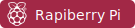

#  Hello, I'm **Álex Duque**

 *Computer Engineering | **Federal University of Itajubá, UNIFEI** (5th semester)*

  *Passionate about **technology**, **programming**, **robotics**, and **embedded systems***

---

##  Skills and Technologies
| Languages 💻 | Systems & Tools 🛠️ |
|:--:|:--:|
|         |        |

---

##  Conect with Me

 

  

